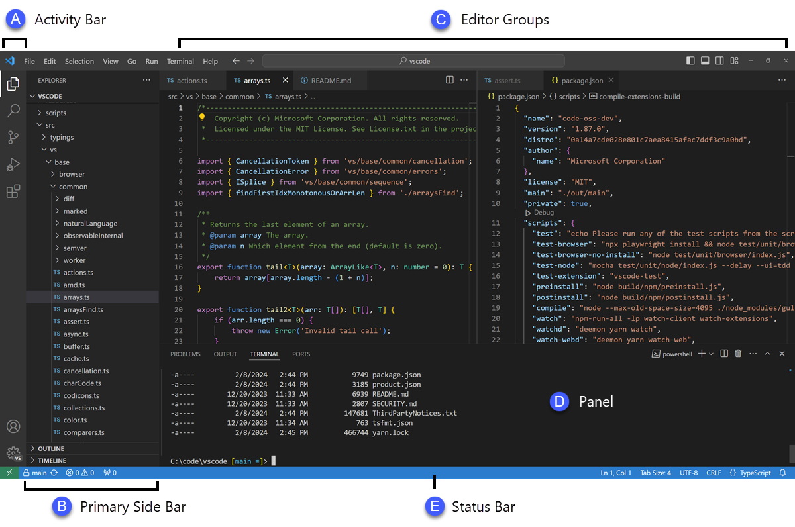
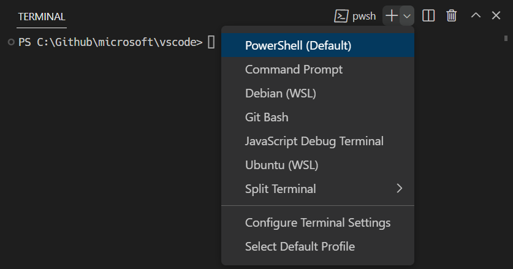
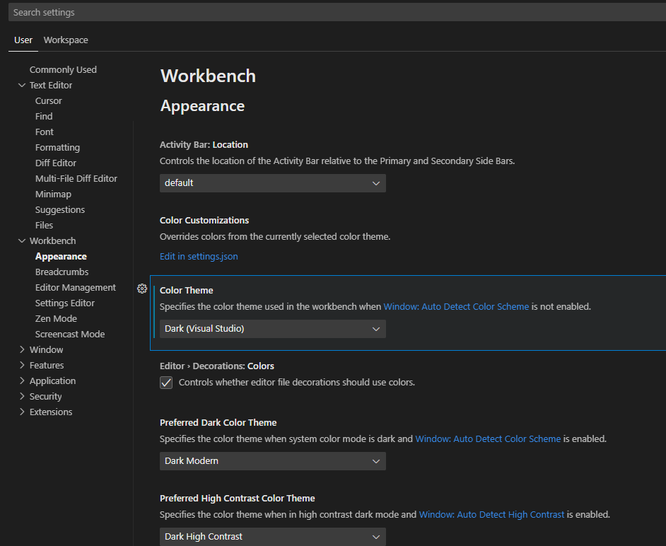

# SE-Assignment-5
Installation and Navigation of Visual Studio Code (VS Code)
 Instructions:
Answer the following questions based on your understanding of the installation and navigation of Visual Studio Code (VS Code). Provide detailed explanations and examples where appropriate.

 Questions:

1. Installation of VS Code:
   - Describe the steps to download and install Visual Studio Code on Windows 11 operating system. Include any prerequisites that might be needed.
      to install VS code, visit the official website and download the visual studio code installer. once downloaded, i locate the file in the downloads folder and click to open the installer. once opened, i read, agree and click to accept the terms offered then click the NEXT prompt. i will choose the folder location where i want my vs code installed, which is the default location for me. i again click the NEXT prompt which takes me to add additional tasks to my vs code such as creating a desktop icon and adding to path. i select these and click NEXT where i am prompted to INSTALL. once i finish installing , i launch my vs code to install the extentions needed such as python, prettier, dart and modify my preference like changing to dark theme.

2. First-time Setup:
   - After installing VS Code, what initial configurations and settings should be adjusted for an optimal coding environment? Mention any important settings or extensions.
         for configuration and adjustment of default settings to the users liking, navigate to file > preferences > settings or the command Ctrl+Shift+P can be used too.
         while in settings, there are a number of things one can do to make the coding environment optimal such as, changing the appearance of the VS Code to their liking like the dark theme for me is the best. font and font size can be changed here too. also, one can enable autosaving in the seeting. this and many more adjustment are done in the seetings.

3. User Interface Overview:
   - Explain the main components of the VS Code user interface. Identify and describe the purpose of the Activity Bar, Side Bar, Editor Group, and Status Bar.
      
      the pictire above shows the location of the activity bar, side bar, editor group and status bar
      1.the activity bar which is located in the far left hadn-side lets the user switch between views
      2.the side bar which is right next to the activity bar, has different views such as the explorer that enables users to work on different folders and files in a project.
      3.The status bar which is horizontally aligned to the bottom of the window, displays information on the current state the opened project and files that are being worked on.
      4.the editor group which is the main area  where users edits their files, allows users to open multiple tabs and split views.

4. Command Palette:
   - What is the Command Palette in VS Code, and how can it be accessed? Provide examples of common tasks that can be performed using the Command Palette.
      the command pallete in VS Code is a tool that provides quick access to a variey of commands and setting. The command pallete shortcut is Ctrl+Shift+P from which a number of tasks can be performed. common tasks that can be performed  through command palette include opening files and folders, configuring settings, managing extensions i.e." extensions: show extensions" to show extensions and running and debugging codes among many other tasks.

5. Extensions in VS Code:
   - Discuss the role of extensions in VS Code. How can users find, install, and manage extensions? Provide examples of essential extensions for web development.
      extensions in VS Code enhance its functionality and tailor it to meet to meet specific development needs. extensions enable the users to customize and  and extend VS Code's capabilities to match their preferences.
      to find extensions, navigate to the activity bar and click on the extensions icon, then search for the extention you need and click to install.
      in the extension view, users can acces a list of already installed extentions ad those that need to upgrade which makes it easy to manage.
      some of the extensions essential for webdevelopment are HTML, JavaScript, Intellisense and React among others.

6. Integrated Terminal:
   - Describe how to open and use the integrated terminal in VS Code. What are the advantages of using the integrated terminal compared to an external terminal?
      integrated terminal offers a convenient way to run tasks directly in VS code which is advantageaous as compared to external terminals that will require a user to work in two different environments. other advantages of working with integrated terminals include easy access to extension features that are within the same environment, enebled project context awareness and consistent environment settings among others.
      to open a terminal, navigate to the menu  bar and click on terminal> new terminal to create a new terminal. in the terminal profile  dropdown, there presents a number of terminal shells that are already installed in you pc from which you can choose which one to work with as a terminal. the common ones include powershell and gitbash. the screenshot below shows some of the terminal shells. 

7. File and Folder Management:
   - Explain how to create, open, and manage files and folders in VS Code. How can users navigate between different files and directories efficiently?

     To create a file or a folder, users have to navigate to the file explorer, open the explorer view by clicking on the explorer icon.the explorer has two icons for creating a new folder or a new file, click on either to create one of them.
     To open a file or a folder, navigate to the file explorer where the folder or file is and roght click on either of them then click to open preview.
      to manage a folder or a file such as deleting, renaming or copying it, right click on the folder or file then click on the option of interest such as delete to delete either of them.

8. Settings and Preferences:
   - Where can users find and customize settings in VS Code? Provide examples of how to change the theme, font size, and keybindings.
      setting are under preference in vs code, therefore a user has to navigate to preferences > setting to be able to access setting for customization. to change the theme, click on workbenck under settings, then appearance. there is a setting on colour theme with a dropdown menu, which gives a user a chance to change the theme to their liking as shown in the picture .  
      font is under text Editor setting. therefore, when in Vs code and a user needs to change the font, should navigate to settings > text editor > font as in the screenshot above
      keybinding is also in workbench setting under settings editor and thats where any modification of it should be done.

9. Debugging in VS Code:
   - Outline the steps to set up and start debugging a simple program in VS Code. What are some key debugging features available in VS Code?
      Setting up and starting debugging in VS Code involves opening your project, installing necessary extensions, creating a launch configuration file, setting breakpoints, and starting the debugging session. Key debugging features include breakpoints, watch expressions, call stack, variables, debug console, step controls, inline values, and logpoints. These tools and features enable a comprehensive and efficient debugging experience, helping developers identify and fix issues in their code.

10. Using Source Control:
    - How can users integrate Git with VS Code for version control? Describe the process of initializing a repository, making commits, and pushing changes to GitHub.
    first, a user needs to install git and create a github account.
    secondly, open a project in vscode and click on initialise respository for this very project by opening source control view to create a new Git respository in your current folder. check the status of the in the source control view to see the changes that haven't been commited and commit them. then create a repository in github and push the changes to github by adding a remote the repository as remote and pushing the changes.

 Submission Guidelines:
- Your answers should be well-structured, concise, and to the point.
- Provide screenshots or step-by-step instructions where applicable.
- Cite any references or sources you use in your answers.
- Submit your completed assignment by 1st July 

